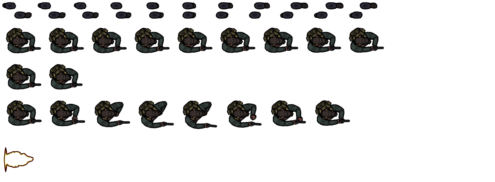

# Игровой движок

- [Базовые классы](#базовые-классы)
  - [GameEngine](#gameengine)
  - [AbstractGameObject](#gameobject)
- [Вспомогательные классы и функции](#вспомогательные-класса)
  - [Sprite](#sprite)
  - [ResourceManager](#resourcemanager)
  - [Расчет столкновений](#расчет-столкновений)
- [Классы игровых объектов](#классы-игровых-объектов)
  - [Hero](#hero)
  - [Base](#base)
  - [Enemy](#enemy)
  - [Bullet](#bullet)

## Базовые классы

### GameEngine

Основной класс. Здесь содержится основная логика работы игры, взаимодействие игрока с героем, обновление состояний объектов и их отрисовка.

Аргументы конструктора

|    Имя     | Описание                                                                                                    |
| :--------: | :---------------------------------------------------------------------------------------------------------- |
| **canvas** | Canvas компонент, необходим для расчетов координат и размеров объектовБ относительно размеров игрового поля |
|  **ctx**   | 2D контекст на котором будет рисоваться игра                                                                |

### GameObject

Абстрактный класс игрового объекта, содержит интерфейс необходимый для оперирования объектами в `GameEngine`

Аргументы конструктора:

|    Имя     | Описание                                     |
| :--------: | :------------------------------------------- |
|   **x**    | Координата объекта по оси х                  |
|   **y**    | Координата объекта по оси у                  |
|  **ctx**   | 2D контекст на котором будет рисоваться игра |
| **canvas** | Canvas компонент                             |

Абстрактные методы для реализации в классах наследниках:

|    Имя     | Описание                                                            |
| :--------: | :------------------------------------------------------------------ |
| **update** | Метод для обновления состояния объекта (координаты, скорость и пр.) |
|  **draw**  | Метод для отрисовки объекта внутри контекста canvas                 |

## Вспомогательные классы

### Sprite

Класс предназначет для взаимодействия игровых объектов с объектами спрайтов и изображениями. Содержит методы для отрисовки как статичного изображения на элементе `canvas`, так и отрисовки анимаций.

Пример изображения:

Аргументы конструктора:

|    Имя     | Описание                                                              |
| :--------: | :-------------------------------------------------------------------- |
|  **ctx**   | 2D контекст, где будет отрисовка спрайта                              |
| **image**  | HTMLImageElement. `src` свойство содержит в себе ссылку на изображение|

Основные методы

- **setAnimationParams(params)**
Устанавливает параметры для анимации для изображения. Принимает объект с параметрами типа:
``` javascript
{
  isAnimated: boolean, // изображение будет использоваться для анимации  
  ticksPerFrame: number, // количество обновлений canvas на один кадр анимации
  numberOfFrames: number, // количество кадров анимации
  reverseAnimation?: boolean, // устанавливает реверсивную анимацию (начало-конец-начало) 
}
```
- **update()**
Обновляет состояние анимации.

- **draw(params)**
Отрисовывает изображение (анимацию) на элементе `canvas`. Принимает объект с параметрами:
``` javascript
{
  x: number; // координаты для отрисовки на canvas
  y: number;
  imgWidth: number; // ширина изображения для отрисовки
  imgHeight: number; // его высота
  imgY: number; // отступ до нужной части спрайта по оси Y
  drawWidth: number; // ширина отрисовки на canvas
  drawHeight: number; // его высота
  rotation?: number; // угол поворота изображения
}
```

### ResourceManager

Класс предназначен для организации работы с внешними файлами, необходимыми для работы игры (изображения, спрайты и тп). 

Основные методы

- **load(img: {name: string, url: string}[])**
Принимает на вход объект с именем и url до изображение или массив объектов с параметрами изображения для загрузки в кэш.

- **get(imageName: string)**
Позволяет получить элемент `HTMLImageElement`, с изображением по его названию.

- **onReady(func: () => void)**
Позволяет установить для класса функцию, которая будет выполнена после загрузки всех изображений в кэш.


### Расчет столкновений

Вспомогательная функция `isCollision` проверяет пересекаются ли между собой два игровых объекта. Игровые объекты могут иметь форму окружности, а также форму прямоугольника. Функция `isCollision` проверяет все комбинации формы объекта и рассчитывает пересечение между ними.

Возвращает `true` в случае, если два объекта пересекаются между собой.

## Классы игровых объектов

### Hero

Описывает логику работы с объектом игрока, наследуется от класса `GameObject`, расширяет его следующими методами:

| Метод                             | Описание                                                        |
| :-------------------------------- | :-------------------------------------------------------------- |
| **moveUp()**                      | двигает игрока вверх по игровому полю                           |
| **moveDown()**                    | двигает игрока вниз по игровому полю                            |
| **moveLeft()**                    | двигает игрока влево по игровому полю                           |
| **moveRight()**                   | двигает игрока вправо по игровому полю                          |
| **stopX()**                       | останавливает игрока по оси х                                   |
| **stopY()**                       | останавливает игрока по оси у                                   |
| **stop()**                        | останавливает движение игрока полностью                         |
| **getDamage()**                   | позволяет движку получить значение урона, которое наносит герой |
| **recieveDamage(damage: number)** | наносит урон игроку                                             |

### Base

Описывает логику работы с объектом базы, наследуется от класса `GameObject`, расширяет его следующими методами:

| Метод                             | Описание                                    |
| :-------------------------------- | :------------------------------------------ |
| **receiveDamage(damage: number)** | наносит урон базе                           |
| **drawHealth()**                  | отрисовывает текущее значение здоровья базы |

### Enemy

Описывает логику работы с объектом противника, наследуется от класса `GameObject`, расширяет его следующими методами:

| Метод                             | Описание                                                            |
| :-------------------------------- | :------------------------------------------------------------------ |
| **move()**                        | двигает противника к базе                                           |
| **stop()**                        | останавливает движение противника                                   |
| **recieveDamage(damage: number)** | наносит урон противнику                                             |
| **getDamage()**                   | позволяет движку получить значение урона, которое наносит противник |
| **getAttackSpeed()**              | позволяет движку получить значение интервала атаки противника       |

### Bullet

Описывает логику работы с объектом снаряда игрока, наследуется от класса `GameObject`, расширяет его следующим методом:

| Метод                                         | Описание                                                                 |
| :-------------------------------------------- | :----------------------------------------------------------------------- |
| **shoot(start: Coordinate, end: Coordinate)** | производит выстрел снаряда по направлению из точки `start` в точку `end` |
